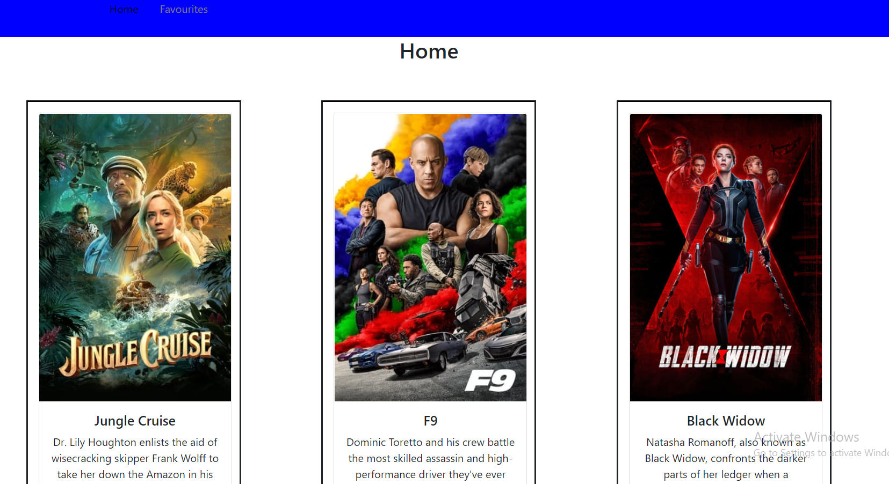
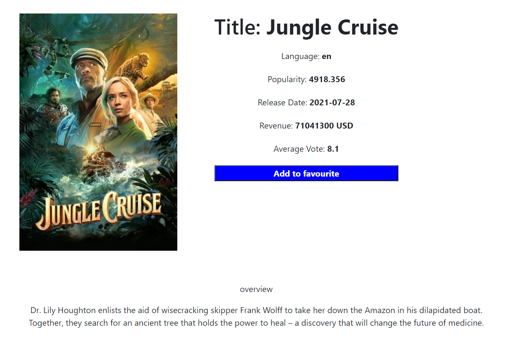

# ReactJS_Movie_Info_Website
This is a website built with ReactJs.
#### From this website anyone can  view now playing movies and movie details. Also people can  make a favourite movie list and remove movies from that list. 
###  React js, React-Router and React-Redux is used in the project. 

### Before Running Locally this project add apikey from https://www.themoviedb.org in show_info/src/config.json file

## Screenshots

---

